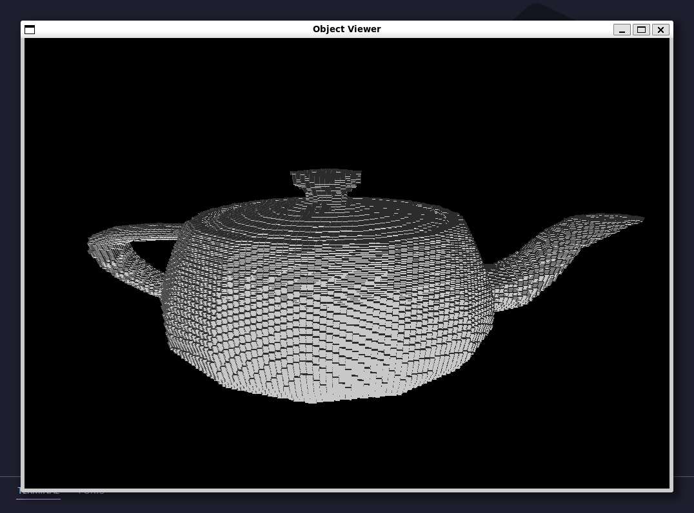

# Voxelization 3D Object Program (Octree-based)

> Tugas Kecil 2 IF2211 Strategi Algoritma

<p align="center">  </p>

## Deskripsi Singkat

Program ini melakukan voxelization terhadap model 3D berbasis struktur data **octree**. Program membaca file `.obj` dari folder `test/input`, kemudian membagi ruang menjadi voxel berdasarkan parameter **max depth**, dan menyimpan hasilnya ke folder `test/output`.

Program juga menyediakan visualisasi objek menggunakan SFML.

---

## Requirement

- CMake >= 3.10
- C++17 compatible compiler
- SFML >= 2.5 dan maksimal 2.x (tidak mendukung versi 3.x atau 1.x)

### Tested on

- GCC 13.3.0 (Linux / WSL)
- MinGW GCC 15.2.0 (Windows)

---

## Instalasi Dependency

**Linux (Ubuntu/Debian):**

```bash
sudo apt install libsfml-dev
```

**Windows:**

- Install SFML (manual atau vcpkg)
- Pastikan SFML_DIR terdeteksi oleh CMake

---

## Quick Start (Recommended)

Gunakan executable yang sudah disediakan.

```bash
cd bin
```

**Linux / WSL:**

```bash
./voxelizer <namafile>.obj <maxdepth>

# Contoh:
./voxelizer teapot.obj 4
```

**Windows (PowerShell):**

```powershell
.\voxelizer.exe <namafile>.obj <maxdepth>

# Contoh:
.\voxelizer.exe cow.obj 6
```

## Command Object Viewer

Program juga menyediakan command untuk langsung membuka visualisasi file `.obj`.

**Linux / WSL:**

```bash
./viewer <output/input>/<nama_file>.obj

# Contoh:
./viewer input/teapot.obj
./viewer output/teapot_voxel.obj
```

**Windows (PowerShell):**

```bash
.\viewer.exe <output/input>\<nama_file>.obj

# Contoh:
.\viewer.exe input\teapot.obj
.\viewer.exe output\teapot_voxel.obj
```

---

## Cara Kompilasi (Opsional)

```bash
mkdir build
cd build
cmake ..
cmake --build .
```

Output akan berada di folder `build/`.

---

## Cara Menjalankan (Hasil Kompilasi Sendiri)

```bash
cd build
```

**Linux / WSL:**

```bash
./voxelizer <namafile>.obj <maxdepth>
```

**Windows (PowerShell):**

```powershell
.\voxelizer.exe <namafile>.obj <maxdepth>
```

---

## Kontrol Visualisasi (SFML)

- Mouse Kiri / Drag: Memutar kamera objek.
- Scroll Wheel: Zoom-in / Zoom-out.
- W/A/S/D: Gerakan kamera (W: naik, A: kiri, S: turun, D: kanan)

---

## Catatan

- File `.obj` harus berada di folder `test/input/`
- Output voxel akan disimpan di `test/output/`
- Program harus dijalankan dari folder `bin/` atau `build/` agar path relatif bekerja dengan benar
- Hanya menerima file `.obj` dengan mesh berbentuk **segitiga (triangular faces)**; face dengan lebih dari 3 vertex tidak didukung

---

## Author

- 13524053 Muhammad Haris Putra Sulastianto
- 13524110 Jennifer Khang

Teknik Informatika, Institut Teknologi Bandung — 2026
